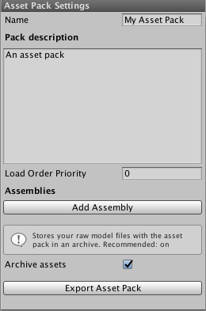
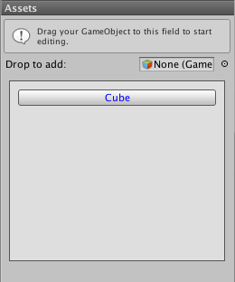
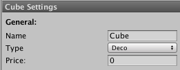

Parkitect Asset Editor
====

.. toctree::
   :maxdepth: 2
   :name: toc-editor

   extended/index
   asset_types/index
   features/index

You'll need:

- `Unity3D <https://store.unity.com/download?ref=personal>`_. Parkitect is currently using Unity 2018.4.23f1 and for best results we recommend you use this version as well.

- the latest Asset Editor package from the `releases page <https://github.com/Parkitect/ParkitectAssetEditor/releases>`_. 

After installing Unity create a new Unity project in a location of your choosing. Next select `Assets > Import package > Custom package` from the top menu. Select the Asset Editor package you've just downloaded. Select everything and hit import. This Unity project is now ready for asset creation.

Open the Asset Editor window from `Window > Parkitect Asset Editor`. Press `New project` in the Asset Editor window. This will ask you for a project name. The project name will also be used as your mod's directory name in the Parkitect mod directory so it must be unique. Press `Create` to start editing.

The asset editor window will switch to edit mode, see [this](editor-window) page for more information on the window.

Example objects
-------

We've included a bunch of example objects in the `Assets/Resources/Reference Objects` folder as size reference and style guides. When creating your own models please keep in mind that the triangle count will have an impact on the performance of the game. Try to keep it as low as possible - for most objects you should be able to stay below 500 triangles. Be especially careful with props that are supposed to be "spammed" like plants, while "one off" objects like sculptures are ok to use a higher triangle count. Big objects that are usually only built once and that are the "star" of a park are ok to use much higher triangle counts of course. Most of the flat rides in the game are somewhere in the range of 20.000 to 30.000 triangles for example.

Features
--------

The editor window consists of multiple sections:

* Asset pack Settings
* Asset list
* Asset settings

Asset pack settings
~~~~~~~~~~~~~~~~~~~

**Name**: The name of your asset pack. This name will also be used as the name of the mod in-game.

**Description**: A description of your asset pack. This description will also be used as the description of the mod in-game.

**Archive assets**: Checking this setting will make the _Export Asset Pack_ button also export the whole "Assets" folder in your Unity project as a zip file. If you choose to upload the asset pack to the Steam Workshop, this zip file will get uploaded with it. This setting can serve as a backup. If you've lost the project or stopped working on it, you (or someone else) can download the asset pack from the Workshop and get the project files back from the zip file to continue working on it. 
Our recommendation is to leave this setting on.

**Load Order Priority**: This setting will set the load order for the assetpack higher values means more last and a lower number will be loaded first

Asset list
~~~~~~~~~~

In the middle section you'll find the asset list. This list contains all the assets that are currently added to the pack. Here you can also add new game objects as an asset.

**Drop to add**: Drag a game object from the scene to this field to add it as an asset.

**Asset list**: In this block there will be a button for every asset you've added so far. Click the button to select the asset. The asset's settings will be shown in the next section _Asset settings_

Asset settings
~~~~~~~~~~~~~~'

If you've selected an asset in the asset list you can alter the settings of one asset in this section. There are 3 settings that every asset has:

**Name**: The name of the asset.

**Price**: The price of the asset in (in-game) dollars.

**Type**: The type of this asset will determine which other settings are available. The types are:

.. toctree::
   :maxdepth: 1
   :caption: Asset Types

   asset_types/bench
   asset_types/bench
   asset_types/deco
   asset_types/fence
   asset_types/flat_ride
   asset_types/lamp
   asset_types/train
   asset_types/trashbin
   asset_types/tv
   asset_types/wall
   extended/asset_types/car
   extended/asset_types/shop

Preview Icon
------

Replace the image located at `Resources/preview.png` with your own one. It will be used as preview icon for your mod inside the game and on Steam Workshop.

